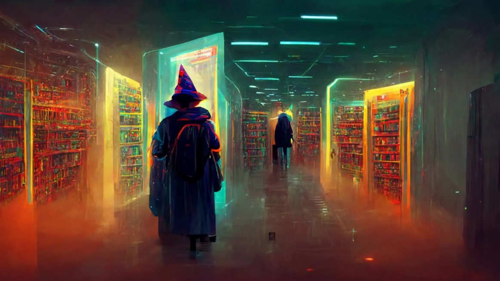

# AI Art: An Introduction to What it Can Do and Its Benefits

Artificial Intelligence (AI) is transforming the world we live in, and
it is no surprise that it is also making waves in the art world. AI art
is a new form of art created with the help of machine learning
algorithms. This innovative technology has enabled artists to create
unique works of art that were previously impossible to imagine. In this
blog post, we will explore what AI art is capable of and what some of
its benefits are.

## What is AI Art?

AI art is a form of art created with the help of machine learning
algorithms. These algorithms are designed to learn patterns and styles
from various sources of data, such as images, videos, and sounds. Once
the algorithm has learned these patterns and styles, it can generate new
artworks that are unique and often surprising.

## What Can AI Art Do?

AI art is capable of producing a wide range of artworks, from paintings
to sculptures, music, and even poetry. One of the most impressive things
about AI art is its ability to create art that is not only aesthetically
pleasing but also thought-provoking. AI art can be used to explore new
artistic styles, generate new ideas, and even tell stories.

One of the most exciting things about AI art is its ability to learn and
adapt. The algorithms used in AI art can be trained to recognize and
replicate the styles of famous artists, such as Pablo Picasso and
Vincent van Gogh. This allows artists to create works of art that pay
homage to these great masters while also adding their own unique touch.

## Benefits of AI Art

1\. Expanding the Boundaries of Art

One of the most significant benefits of AI art is that it allows artists
to push the boundaries of what is possible in the art world. By using
machine learning algorithms, artists can create works of art that are
unlike anything that has been seen before.

2\. Increased Accessibility

AI art has the potential to make art more accessible to people who may
not have had the opportunity to engage with it in the past. By using
digital platforms to share their creations, AI artists can reach a
broader audience and expose more people to the world of art.

3\. Collaboration and Innovation

AI art also opens up new possibilities for collaboration and innovation.
Artists can work together with computer scientists and software
engineers to create new tools and techniques that can be used in the art
world.

## Conclusion

AI art is a fascinating new form of art that is changing the way we
think about creativity and innovation. It has the potential to expand
the boundaries of art, increase accessibility, and foster collaboration
and innovation. As AI technology continues to evolve, we can expect to
see even more exciting developments in the world of AI art.

Example AI art

The following are example AI art results for different logos that I
created.

[Back](/promptdoc.md)   |   [Home](/index.md)   |   [Next](/)
