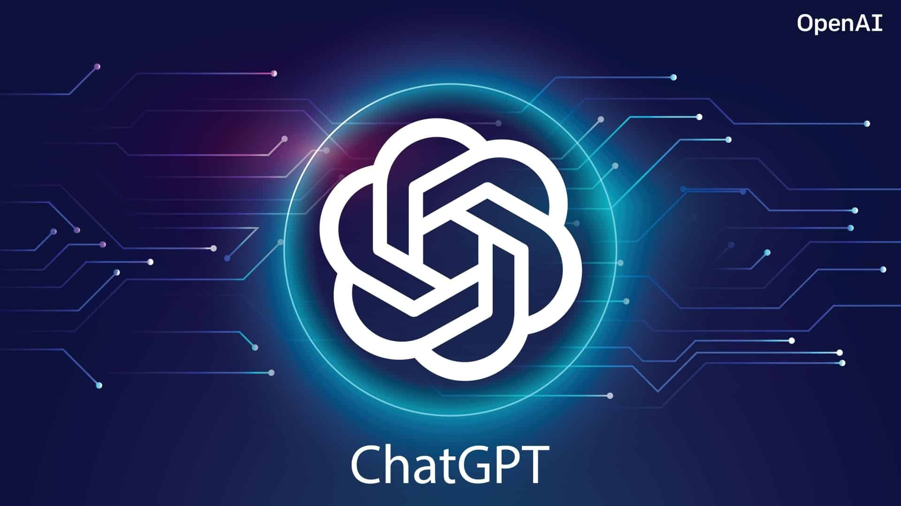

# ChatGPT: The Power of Conversational AI

Artificial Intelligence (AI) has been making leaps and bounds in the
last decade, and one of its most impressive applications has been in the
field of conversational AI. ChatGPT, a large language model trained by
OpenAI based on the GPT-3.5 architecture, is one such example of
conversational AI that is making waves in the industry. In this post, we
will explore what ChatGPT is able to do and some of its benefits.

## What is ChatGPT?

ChatGPT is a chatbot that uses AI to simulate human-like conversations.
It is based on the GPT-3.5 architecture, which means that it is a
large-scale neural network that is capable of generating human-like text
based on the input it receives. The GPT-3.5 architecture is one of the
most advanced natural language processing (NLP) models available, and it
is capable of generating text that is indistinguishable from
human-written text.

## What is ChatGPT able to do?

ChatGPT is capable of performing a wide range of tasks. It can answer
questions, provide information, give recommendations, and even engage in
casual conversation. It can be integrated into a wide range of
applications, from customer service chatbots to personal assistants.
Here are some of the things that ChatGPT is able to do:

1\. Answer questions: ChatGPT is able to provide answers to a wide range
of questions, from simple queries to more complex ones. It can
understand natural language questions and provide accurate answers in
real-time.

2\. Provide information: ChatGPT is able to provide information on a
wide range of topics, from news and weather to sports and entertainment.
It can also provide detailed product information, making it a useful
tool for customer service applications.

3\. Give recommendations: ChatGPT is able to provide personalized
recommendations based on user preferences. For example, it can suggest
books, movies, and music based on user interests.

4\. Engage in casual conversation: ChatGPT is able to engage in casual
conversation with users, making it a useful tool for personal assistant
applications. It can understand and respond to natural language queries,
allowing users to interact with it in a conversational manner.

## What are the benefits of ChatGPT?

1\. Improved customer service: ChatGPT can be integrated into customer
service chatbots, providing customers with real-time answers to their
questions. This can improve customer satisfaction and reduce the
workload of customer service agents.

2\. Personalized recommendations: ChatGPT is able to provide
personalized recommendations based on user preferences. This can help
users discover new products and services that they may be interested in.

3\. Increased efficiency: ChatGPT can perform tasks faster than a human
operator, allowing businesses to improve their efficiency and reduce
their costs.

4\. 24/7 availability: ChatGPT is available 24/7, which means that users
can interact with it at any time. This can improve the user experience
and provide users with instant access to information and assistance.

## Conclusion

In conclusion, ChatGPT is a powerful tool that is capable of performing
a wide range of tasks. It is based on advanced NLP models and is able to
generate human-like text, making it a useful tool for a wide range of
applications. Its benefits include improved customer service,
personalized recommendations, increased efficiency, and 24/7
availability. As AI continues to advance, we can expect to see even more
impressive applications of conversational AI like ChatGPT in the future.

[Back](/AIARTdoc.md)   |   [Home](/index.md)   |   [Next](/)
