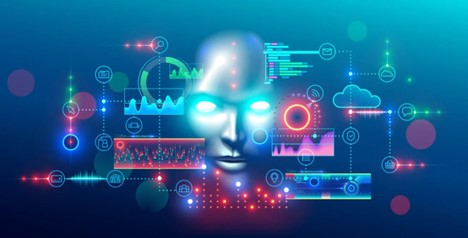

# Concerns with AI

Artificial intelligence (AI) has been making significant progress over
the past few years, and it's already being used in a wide range of
applications, including self-driving cars, virtual assistants, and
facial recognition technology. However, as with any rapidly advancing
technology, there are concerns about its impact on society. In this blog
post, we will explore some of the current issues surrounding AI and some
of the worries associated with it.

One of the biggest issues with AI is the potential loss of jobs. AI has
the potential to automate many jobs currently done by humans, and some
experts predict that up to 40% of jobs may be at risk in the next 15
years. While AI can increase productivity and efficiency, it may also
lead to significant job losses and could exacerbate income inequality.

Another concern is the ethical implications of AI. As AI becomes more
advanced, there are concerns about its impact on privacy, bias, and
discrimination. For example, facial recognition technology has been
criticized for its potential to be used for surveillance and the
potential for bias against certain demographics.

There are also concerns about the misuse of AI. As AI technology
advances, it has the potential to be used for malicious purposes, such
as cyber-attacks or creating fake news. This highlights the need for
strong cybersecurity measures and increased public awareness of the
potential risks associated with AI.

Despite these worries, there are also many benefits to AI. AI can
improve efficiency, accuracy, and productivity in a variety of
industries, from healthcare to finance. AI can also assist in tasks that
are dangerous or impossible for humans, such as exploring space or
predicting natural disasters.

Another benefit of AI is its potential to improve the quality of life
for people around the world. AI can help to address global challenges
such as climate change, disease outbreaks, and poverty. For example, AI
can assist in identifying areas of high pollution or predicting the
spread of diseases, which can lead to more effective prevention and
treatment.

In conclusion, while AI has the potential to bring significant benefits
to society, it also comes with its fair share of worries. It is
important to continue to monitor the development of AI and address these
concerns as they arise. Ultimately, AI is a tool that can be used for
both good and bad, and it is up to us to ensure that it is used in a
responsible and ethical manner.

[Back](/ChatGPT.md)   |   [Home](/index.md)   |   ...
