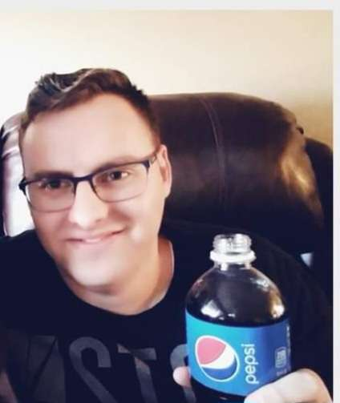

# About me

Hello! My name is Tyler Winder, and I am pleased to introduce myself as
the author of this blog. Thank you for visiting!

## Qualifications:

I pride myself on being highly organized with a strong work ethic. I
have a knack for organizing, training, and facilitating meetings of
large groups. As a self-starter and discussion leader, I am skilled at
motivating teams with foresight and the ability to multi-task and
complete complex cross-functional projects. Additionally, I have strong
analytical skills that assist me in documentation, maintenance, and
engineering principles.

## Education:

I am currently a double major in Electrical Engineering and Computer
Software Engineering at Arizona State University, where I have
maintained a GPA of 3.54. Before attending ASU, I completed my general
studies at Mesa Community College. In 2016, I graduated from Mountain
View High School with honors.

## Work Experience:

I have had a variety of job experiences that have helped me develop my
leadership, management, and communication skills. From being a Lead
Instructor at Bricks 4 Kidz, where I taught engineering curriculum and
principles to school-aged children, to being a Facility Supervisor at
the Arizona State University Fitness Center, where I directed security,
coordinated first-aid, and acted as event supervision for approximately
25 campus events, I have honed my skills in a variety of settings. I
have also managed schedules, payroll, and daily operations of up to 15
staff members across two locations as a Shift Manager at Krazy Air
Trampoline and facilitated and led district meetings of approximately
20-30 volunteer missionaries monthly as a District Leader for The Church
of Jesus Christ of Latter-day Saints in Buenos Aires, Argentina.

## Skills and Achievements:

I am bilingual in English and Spanish and proficient in Microsoft Office
(Word, PowerPoint, Excel). Additionally, I have knowledge and
proficiency in Autodesk Inventor. I am an Eagle Scout and have achieved
a black belt in karate through Young Champions of America. Lastly, I
have created a portfolio that showcases some of my work and
achievements, which you can find here: https://eden57.

Thank you for taking the time to get to know me better. I look forward
to sharing my insights and experiences with you through this blog.

## Table of contents

* [What is prompt engineering](/promptdoc.md)
* AI Art
* Chat GPT
* concerns about AI
